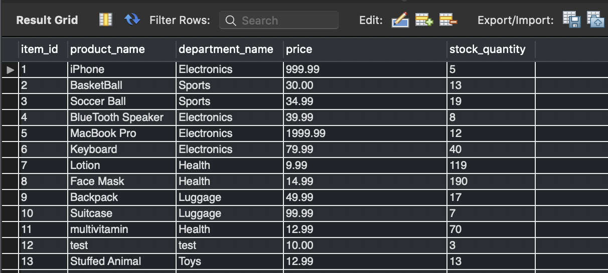

# bamazon

Bamazon is a mock store like Amazon where customers can pick an item from the list and purchase an item by an ID number. This is a CLI app that uses inquirer to ask users questions about the item they would like to purchase. This uses `mysql` to store data from the app and update when necessary 

## Customer View

## Manager View

## MySQL

## Technologies Utilized
* NodeJs 
* JavaScript
* Mysql
* Inquirer
* Colors

